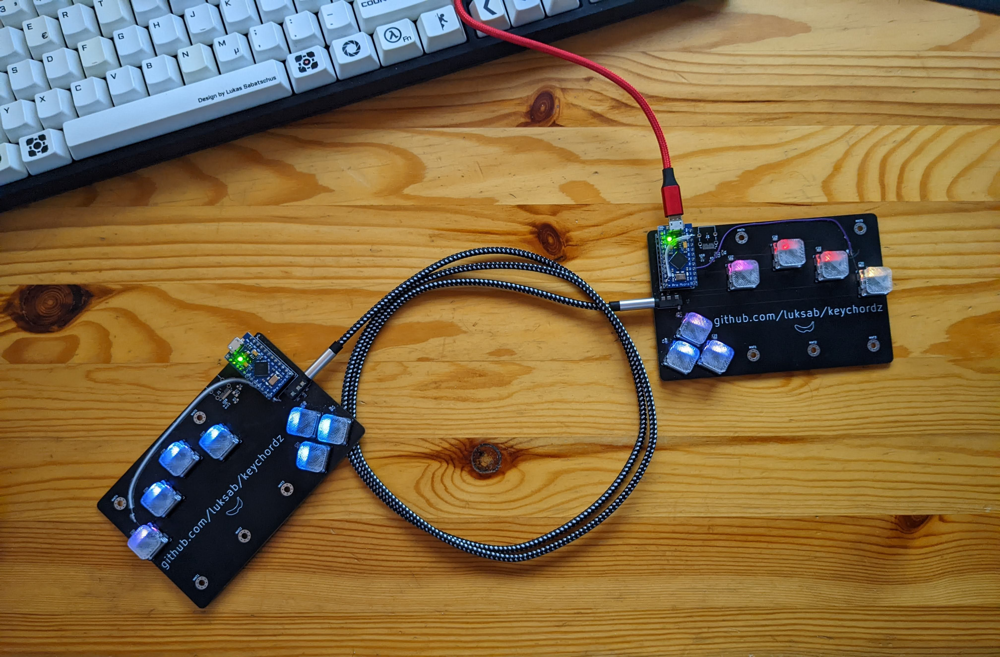

# Keychordz

This is my first completely custom keyboard hardware/software.

## Hardware

The hardware design is done in [KiCad](https://www.kicad.org/) and can be found in the hardware folder.

## Software

I started configuring [QMK](https://docs.qmk.fm/#/) for this hardware, but the chording features turned out to be too limiting, so I decided to write my own firmware from scratch in [Rust](https://rust-lang.org/).
